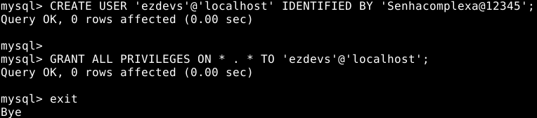

# init-cloud
Primeiros passos na configuração de um servidor na nuvem.

## Antes de começar
### O que é
- VPS (Virtual Private Server)
- SSH (Secure Shell)

## Criando digital ocean
- Criando uma instancia na digital ocean

### Criando Droplet
Inicialmente temos as opções
- Distribuições
- Containers de distribuições
- Marketplace
- Backups
- Imagem customizada

Vamos escolher **distribuição** e ir para a **Ubuntu 16.04 X64**.

### Escolhendo plano
Tome cuidado com o plano, pois inicialmente ele inicia com um valor alto.


Vamos usar a do tipo **Standard**.


Depois a maquina de **$ 5/mo**.

Escolhendo a localização


Tambem podemos selecionais adicionais e adicionar SSH.


Podemos adicionar uma chave


Adicionando SSH


Finalizando a criação

### Adicionando backup
É recomendado usar o backup usado pela digital ocean, e nos ajuda realizando toda semana o backup da imagem.
> Isso tem o valor de 1 dolar por mes.

### Criando chave publica e adicionando SSH Key
Podemos adicionar uma chave agora na criação da maquina.

> Vamos adicionar mais tarde uma chave de forma manualmente.

#### Vamos criar uma chave
```sh
ssh-keygen -r rsa
```

#### Adicionando chave
Vamos copiar a chave usando179.80.189.242
```sh
cat ~/.ssh/id_rsa.pub
```

## SSH
### O que é
- O que é o Secure Shell (SSH)

### Instalação
- Instalando no Linux

Veja como podemos instalar o openssh client
```sh
sudo apt-get install openssh-client
```

## Primeiro Conexão

Já com o openssh-client instalado em nossa maquina, vamos pegar o endereço IP da maquina e realizar o teste.

Vamos imaginar que nosso IP é**159.89.49.76**.
```sh
ssh root@159.89.49.76
```
> Inicialmente vamos realizar a primeira conexão com **root**.

### Criando um novo usuario

Vamos adicionar um novo usuario
```sh
adduser ezdevs
```

### Adicionando ao grupo sudo
Por motivos de segurança não é recomendado usar o **root** e assim podemos usar o **sudo**.

Vamos instalar o **sudo**.
```sh
apt-get install sudo
```


Vamos adicionar ele ao grupo sudo
```sh
adduser ezdevs sudo
```

### Adicionando KEY
Vamos até o arquivo
```sh
nano ~/.ssh/authorized_keys
```

> Vamos copiar a chave publica de nossa maquina usando **cat ~/.ssh/id_rsa.pub**.
> Caso não tenha criada podemos usar o **ssh-keygen**.

#### Testando acesso
Podemos testar acesso ao usuario **root**.
```sh
ssh root@159.89.49.76
```
> Podemos ver que conseguimos acessar

#### Adicionando chave ao usuario ezdevs
Agora vamos adicionar a chave para o usuario **ezdevs**.

Vamos criar um diretorio
```sh
mkdir /home/ezdevs/.ssh/
```

Vamos criar um arquivo chamado
```sh
nano /home/ezdevs/.ssh/authorized_keys
```

Vamos adicionar a chave nele
```sh
ssh-rsa AAAAB3NzaC1yc2EAAAADAQABAAABAQDKSYtHZp2am44d+FPMeDAA4khsBYajrMP39rkmCmJ8wgVqSDCYEm89to//P7QKffKDQOAhNClJxcsUfLL5uxDQ8yAM8pXE+IoStnTeAUBOds7IZupJLiwtwkIjsGpLXfqfTAu1P9knp1UbN+BG9wDls8+xfgkWVesDbapjUBlHS4HOqBDV+v8ny+nOBnErmuFzul+d5nHYkdHzkSMRJJWCh/56PVa1zDZqkjOG/RfRx7MOxB7gUj46wUvQqeaaXhIhF10jnEsQ7+czgIFinqrBTaYCUPJq3BL73gbOkBBrTO6BIN+WPzQmi3Wclvuus8w6jeWTsvoqALOGjua74a29 greenmind@abase
```

### Logando no sistema
Podemos agora logar no sistema usando o usuario **ezdevs**.
```sh
ssh ezdevs@159.89.49.76
```

### Configuração SSH
Vamos entrar no arquivo **/etc/ssh/ssh_config** e editar ele.

- Retirando login senha
- Inserindo login por chave publica
> Podemos descomentar a linha **PasswordAuthentication yes** e mudar para **no**.

- Retirando login root
> Vamos alterar de **PermitRootLogin yes** para **PermitRootLogin no**.

- Perigos de logando por senha
> Logando por senha você pode ser hackeado ou até receber um ataque de brute.

Depois de realizar todas as configurações vamos realizar um restart no serviço
```sh
sudo service ssh restart
```

## Node
### O que é
Node.js é uma plataforma construída sobre o motor JavaScript do Google Chrome para facilmente construir aplicações de rede rápidas e escaláveis. Node.js usa um modelo de I/O direcionada a evento não bloqueante que o torna leve e eficiente, ideal para aplicações em tempo real com troca intensa de dados através de dispositivos distribuídos.

> http://nodebr.com/o-que-e-node-js/

### Instalando no Linux
Aqui vai um exemplo de como podemos instalar a versão **LTS** do node para:
- Debian s2
- Ubuntu

```sh
# Using Ubuntu
curl -sL https://deb.nodesource.com/setup_10.x | sudo -E bash -
sudo apt-get install -y nodejs

# Using Debian, as root
curl -sL https://deb.nodesource.com/setup_10.x | bash -
apt-get install -y nodejs
```
> Referencia: https://github.com/nodesource/distributions#deb

### Como usar
- NPM install
> Costumamos usar ele para instalar os requisitos ou uma biblioteca especifica

- NPM run
> Usamos ele para executar algo, um exemplo é o **npm run build**.

- NPM serve
> Podemos usar o **npm serve** para servir uma aplicação.

## Mysql
### O que é
O MySQL é um sistema de gerenciamento de banco de dados, que utiliza a linguagem SQL como interface. É atualmente um dos sistemas de gerenciamento de bancos de dados mais populares da Oracle Corporation, com mais de 10 milhões de instalações pelo mundo.

### Instalando
- Instalando no Linux

Podemos instalar o **mysql-server** da seguinte forma
```sh
apt-get install mysql-server
```

Por motivos de segurança vamos usar o
```sh
sudo mysql_secure_installation
```
> Com ele temos configurações de segurança, remove banco de testes, usuarios anonimos, acesso root remoto e seta uma senha root.

### Configurando

- Configurações de segurança
```sh
# Criando usario
CREATE USER 'ezdevs'@'localhost' IDENTIFIED BY 'Senhacomplexa@12345';
# Dando permissão ao usuario
GRANT ALL PRIVILEGES ON * . * TO 'ezdevs'@'localhost';
```


- Criação de banco
> Podemos entrar no banco com o nosso usuario criado anteriormente é realizar
```sh
create database nome;
```

- Exportar/Importar DB
```sh
# Exportar
mysqldump -uroot -p nome_do_banco > /home/bkp.database.db

# Importar
mysql -uroot -p
mysql> source /home/bkp.database.db
```

## Mongo
### O que é

### Configuração
```sh
wget -qO - https://www.mongodb.org/static/pgp/server-4.2.asc | sudo apt-key add -
echo "deb [ arch=amd64 ] https://repo.mongodb.org/apt/ubuntu bionic/mongodb-org/4.2 multiverse" | sudo tee /etc/apt/sources.list.d/mongodb-org-4.2.list
sudo apt-get update
sudo apt-get install -y mongodb-org
```

### Inserindo senha MongoDB
> https://medium.com/@mathiasghenoazzolini/habilitando-autentica%C3%A7%C3%A3o-no-mongodb-usu%C3%A1rio-root-e3809504f4a

Podemos ver o estdado do mongo com o comando
```sh
sudo service mongod status
```

Podemos iniciar o serviço usando
```sh
sudo service mongod start
```

Podemos ver ao iniciar qual o diretorio que está o arquivo de configuração , podemos ver inicialmente o
```sh
sudo nano /etc/mongod.conf
```

> Podemos procurar o arquivo de configuração usando o locate **sudo locate mongod.conf**.

Lá temos informações importantes do mongo , por padrão o mongo funciona na porta 27017.

Podemos logar no mongo da seguinte forma
```sh
sudo mongo --port 27017
```

Depois que logar podemos usar o comando **use** seguindo do nome do banco que vamos usar que no caso é o **admin**.
```sh
use admin
```

Agora já estamos no banco , podemos
```sh
db.createUser(
 {
 user: "admin",
 pwd: "PROD_C0mpl3x_M0ngo",
 roles: [ "userAdminAnyDatabase",
          "dbAdminAnyDatabase",
          "readWriteAnyDatabase",
	  "readWrite"]
 }
)
```

Para logar
```sh
db.auth("admin","PROD_C0mpl3x_M0ngo")
```

Por padrão a autenticação de senha não é habilitada , podemos ir até o arquivo de configuração para resolver isso.
```sh
sudo nano /etc/mongod.conf
```

Vamos procurar por **authorization** e adicionar para enable.
```sh
security:
   authorization: enabled
```

Para que as configurações deem certo é necessario realizar um
```sh
sudo service mongod restart
```


## PM2
### O que é
O PM2 é um gerenciador de processos para o tempo de execução do JavaScript Node.js. Usamos ele para gerenciar nossas aplicações e assim servindo nosso projeto.

### Instalando
- Instalando no Linux
```sh
npm install pm2@latest -g
```

### Configurando
```sh
# configura o pm2 para inicializar com o sistema operacional.
pm2 startup
```

- Subindo projeto
```sh
# No -i, é possível delimitar o número de CPUs usadas
pm2 start app.js -i 1
```

- Criando arquivo de configuração
```sh
#Depois de iniciar todos os aplicativos que você deseja gerenciar, salve a lista que deseja recuperar na reinicialização da máquina com:
pm2 save
```

- Verificar se mesmo o serviço caindo ele volte usando o resurrect
```sh
# Ressuscitar manualmente os processos
# Isso traz de volta processos salvos anteriormente (via pm2 save):
pm2 resurrect
```

## NGINX
### O que é
Nginx (lê-se "engine x") é um servidor HTTP e proxy reverso, bem como um servidor para proxy de email IMAP/POP3, escrito por Igor Sysoev desde 2005.

O Nginx é um servidor web rápido, leve, e com inúmeras possibilidades de configuração para melhor performance.

### Instalando
- Instalando no Linux
```sh
apt-get install nginx
```

### Configurando
- Criando proxy reverso
> Podemos criar um proxy reverso da seguinte forma
```sh
server {
  server_name api.aplicativos.org;
  #LOG
  #access_log /var/log/nginx/API/access.log;
  #error_log  /var/log/nginx/API/error.log;

location / {

  proxy_pass http://127.0.0.1:3399; # nodejs is on the same machine
  # proxy_pass http://192.168.1.1xx:3000; # if on a different machine in the local network.
  proxy_set_header Host $host;
  proxy_set_header X-Real-IP $remote_addr;
  proxy_set_header X-Forwarded-For $proxy_add_x_forwarded_for;
  proxy_set_header X-Forwarded-Proto $scheme;
 }
}
```

- Servindo site estático
> Podemos criar a configuração para servir um site estatico.
```sh
server {
  server_name web.aplicativos.org;
  root /home/ezdevs/web/dist/;

  index index.html index.html;

  #LOG
  access_log /var/log/nginx/WEB/access.log;
  error_log /var/log/nginx/WEB/error.log;

  location / {
    try_files $uri $uri/ @rewrites;
  }

  location @rewrites {
    rewrite ^(.+)$ /index.html last;
  }

  location ~ /.well-known/apple-app-site-association {
    default_type application/pkcs7-mime;
  }

}
```

## Resolvendo erros
- Reiniciar servidor


## Firewall (UFW)

### O que é
Um firewall tem como objetivo nos auxiliar na segurança de uma rede de computadores usando políticas de segurança a um determinado ponto da rede. O firewall pode ser do tipo filtros de pacotes, proxy de aplicações, etc. Os firewalls são geralmente associados a redes TCP/IP.

### Instalando
- Instalando no Linux
```sh
apt-get install ufw
```

### Configurando
- Verificando os perigos de usar sem firewall
> Uma porta exporta pode ser um problema pois pessoas podem acabar tentando acesso um serviço, por exemplo o mysql.

- Cuidados a serem tomados
> É recomendado que apenas as portas **22** (mesmo assim é recomendado estar usando uma VPN),**80** (HTTP), **443** (HTTPS).

- Criando firewall
> Criando firewall para a porta 3306 **mysql**.
```sh
ufw enable
ufw deny 3306
```
